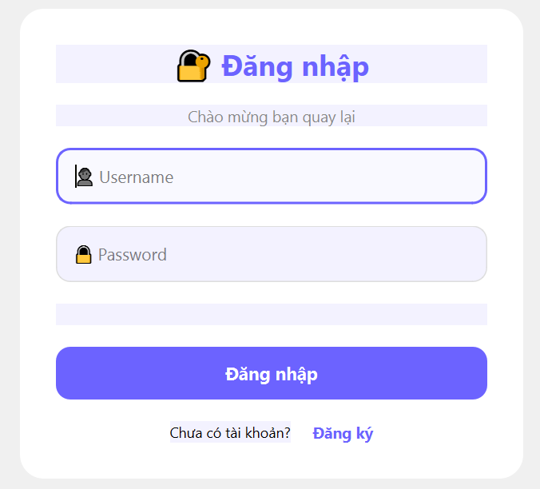
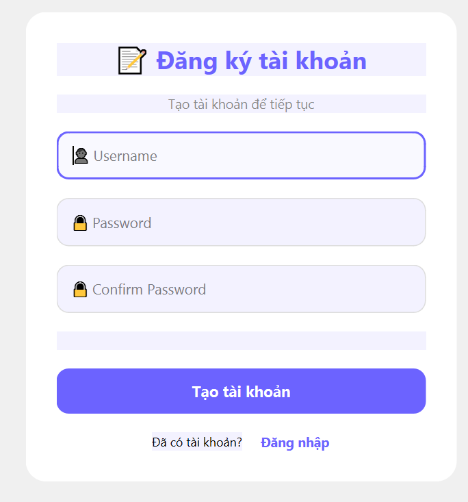
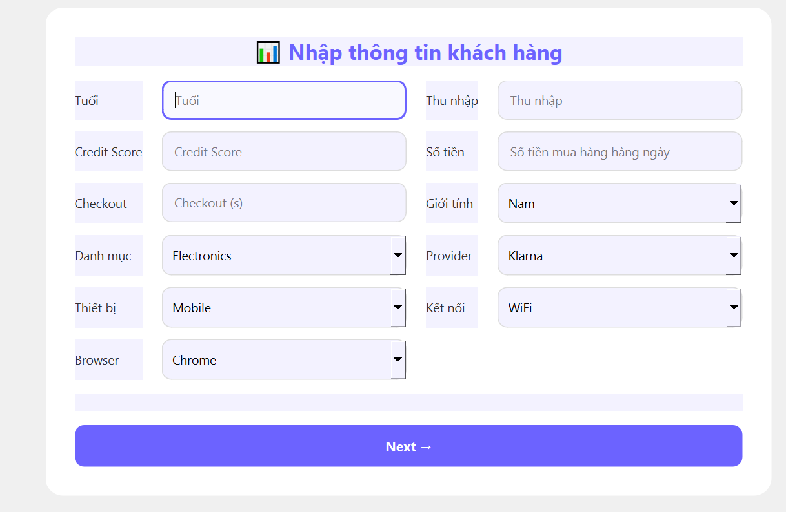
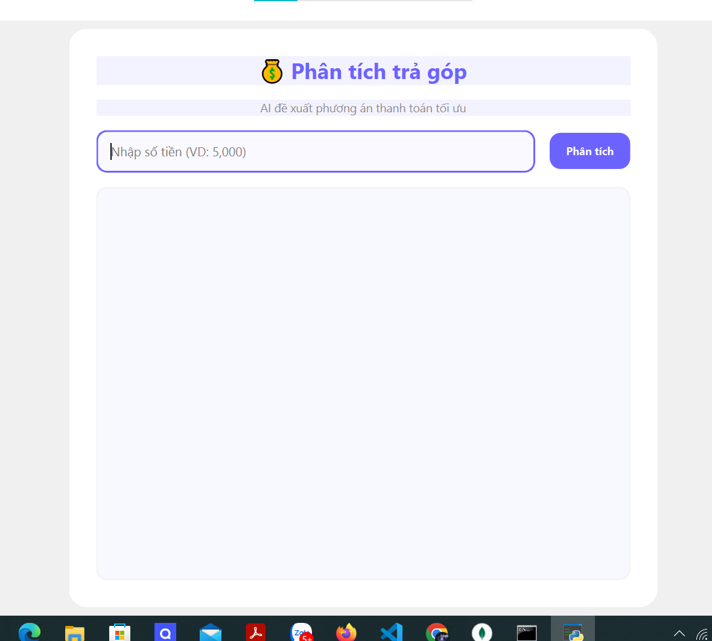

````md
# AI_for_BNPL

Hệ thống phân tích rủi ro và tư vấn trả góp BNPL bằng AI.

---

# 📌 Giới thiệu dự án

Đây là dự án xây dựng hệ thống AI hỗ trợ phân tích rủi ro tài chính và đề xuất phương án trả góp cho mô hình **Buy Now Pay Later (BNPL)**.

Dự án được xây dựng để phục vụ cho đồ án cuối kỳ của môn học **Giải pháp AI trong Kinh doanh và Quản lý** thuộc chương trình đào tạo của Trường Đại học Kinh tế - Luật.

Dự án được thực hiện bởi nhóm sinh viên đến từ hai ngành:

- Hệ thống Thông tin Quản lý (mã ngành: 406)
- Kinh tế Đối ngoại (mã ngành: 402)

Hệ thống sử dụng Machine Learning để dự đoán khả năng thanh toán của khách hàng dựa trên dữ liệu tài chính, hành vi giao dịch và dữ liệu tín dụng.

---

# 🎯 Mục tiêu hệ thống

Hệ thống được xây dựng nhằm:

- Dự đoán xác suất khách hàng trễ hạn hoặc vỡ nợ
- Đề xuất phương án trả góp phù hợp từ 1 → 12 tháng
- Hỗ trợ doanh nghiệp BNPL tối ưu quản trị rủi ro tín dụng
- Tăng khả năng chuyển đổi giao dịch
- Hỗ trợ ra quyết định dựa trên dữ liệu và AI

---

# 🚀 Chức năng chính

## 🔍 Phân tích rủi ro khách hàng

Hệ thống sử dụng mô hình Machine Learning để dự đoán khả năng thanh toán của khách hàng dựa trên:

- Thu nhập
- Điểm tín dụng
- Giá trị đơn hàng
- Hành vi sử dụng hệ thống
- Thiết bị và trình duyệt sử dụng

## 💳 Đề xuất trả góp

Hệ thống mô phỏng nhiều phương án trả góp khác nhau và lựa chọn phương án có mức độ rủi ro thấp nhất.

## 🖥️ Giao diện người dùng

Ứng dụng được xây dựng bằng PyQt6 gồm:

- Đăng nhập / Đăng ký
- Nhập thông tin cá nhân
- Phân tích dữ liệu
- Hiển thị kết quả AI

## 🗄️ Quản lý dữ liệu

MongoDB được sử dụng để:

- Lưu tài khoản người dùng
- Lưu dữ liệu khách hàng
- Lưu kết quả dự đoán AI

---

# 🧠 Công nghệ sử dụng

## Backend

- Python
- MongoDB

## AI / Machine Learning

- LightGBM
- Scikit-learn
- Pandas
- NumPy

## Frontend

- PyQt6

---

# 📊 Dataset

Dataset được sử dụng cho dự án là bộ dữ liệu BNPL từ Kaggle với khoảng:

- 50.000 dòng dữ liệu
- 13 biến dữ liệu

Dữ liệu bao gồm:

- Thông tin khách hàng
- Thu nhập hàng năm
- Điểm tín dụng
- Giá trị đơn hàng
- Hành vi thanh toán
- Thiết bị sử dụng
- Trình duyệt
- Nhà cung cấp BNPL

Bài toán được xây dựng dưới dạng:

- Binary Classification
- Dự đoán:
  - Thanh toán đúng hạn
  - Trễ hạn / Vỡ nợ

---

# 🖥️ Frontend

## Frontend (1)


## Frontend (2)


## Frontend (3)


## Frontend (4)


---

# 🏗️ Workflow hệ thống

```text
Người dùng đăng nhập tài khoản
          ↓
Frontend Login
          ↓
MongoDB kiểm tra tài khoản
          ↓
Frontend Dashboard
          ↓
Nhập thông tin khách hàng
          ↓
Lưu vào MongoDB
          ↓
Nhập yêu cầu BNPL
          ↓
Model AI phân tích dữ liệu
          ↓
Xuất kết quả dự đoán
          ↓
Lưu lịch sử xuống MongoDB
          ↓
Hiển thị kết quả lên giao diện
````

---

# 🤖 Mô hình AI

Dự án sử dụng mô hình **LightGBM Classifier** cho bài toán phân loại nhị phân.

## Các bước chính

* Tiền xử lý dữ liệu
* Chuẩn hóa dữ liệu
* Label Encoding
* Feature Engineering
* Train/Test Split
* Huấn luyện mô hình
* Đánh giá ROC-AUC

## Các đặc trưng quan trọng

* Annual Income
* Credit Score
* Purchase Amount
* Monthly Payment
* Payment to Income Ratio

## Metric đánh giá

* ROC-AUC

---

# 💻 Chức năng ứng dụng

Hệ thống bao gồm:

* Đăng nhập / Đăng ký
* Nhập thông tin khách hàng
* Dự đoán rủi ro
* Đề xuất số tháng trả góp
* Lưu lịch sử dự đoán
* Quản lý dữ liệu MongoDB

---

# 🔗 File huấn luyện mô hình

Google Colab:

https://colab.research.google.com/drive/1Gq38EFp9xxxqEKMIGc79CJiqxJCU4XJY?usp=sharing

---

# 📂 Cấu trúc thư mục

```bash
AI_for_BNPL/
│
├── core/
│   ├── auth_service.py
│   ├── customer_service.py
│   ├── db.py
│   ├── model_service.py
│   └── predict_service.py
│
├── ui/
│   ├── analyze_ui.py
│   ├── customer_ui.py
│   ├── login_ui.py
│   └── register_ui.py
│
├── docs/
│   ├── 1.png
│   ├── 2.png
│   ├── 3.png
│   ├── 4.png
│   └── AI_for_BNPL_Report.pdf
│
├── config.txt
├── main.py
├── model.pkl
├── README.md
└── test.py
```

---

# 📌 Mô tả thư mục

## `core/`

Chứa toàn bộ phần xử lý chính của hệ thống:

* Xử lý đăng nhập
* Kết nối MongoDB
* Xử lý model AI
* Dự đoán rủi ro
* Logic nghiệp vụ BNPL

## `ui/`

Chứa giao diện người dùng được xây dựng bằng PyQt6:

* Màn hình đăng nhập
* Đăng ký tài khoản
* Nhập thông tin khách hàng
* Phân tích và hiển thị kết quả AI

## `docs/`

Chứa:

* Hình ảnh giao diện
* Báo cáo đồ án
* Tài liệu liên quan

## `model.pkl`

File mô hình Machine Learning đã được huấn luyện.

## `main.py`

File khởi chạy chính của ứng dụng.

## `config.txt`

Lưu các cấu hình cần thiết cho hệ thống.

## `test.py`

Dùng để kiểm thử hệ thống và mô hình AI.

---

---

# ▶️ Run Project

```bash
python main.py
```

---

# 📈 Hướng phát triển

Trong tương lai, dự án có thể mở rộng:

* Triển khai Web Application
* Xây dựng REST API
* Dự đoán thời gian thực
* Explainable AI (XAI)
* Continuous Learning
* Tăng độ chính xác mô hình
* Tích hợp với nền tảng thương mại điện tử
* Tích hợp hệ thống tài chính thực tế

---

# 👥 Thành viên thực hiện

* Mai Ngọc Thi (406)
* Phan Ngọc Linh (402)
* Bùi Vũ Khánh Phương (402)
* Nguyễn Thị Ngọc Tú (402)
* Nguyễn Điền Xuân Nghi (406)

---

# 📚 Tài liệu tham khảo

1. Zhi Zheng Kang, Sin Yin Teh, Samuel Yong Guang Tan và Wei Chien Ng
   *Loan Default Prediction Using Machine Learning Algorithms*, 2025
   https://journals.mmupress.com/index.php/jiwe/article/view/1680

2. Sakshi Udavant
   *Buy Now, Pay Later (BNPL): What It Is, How It Works, Pros and Cons*, 2025
   https://www.investopedia.com/buy-now-pay-later-5182291

3. Kexin Zhao, Bo Wang, Cuiying Zhao, Tongyao Wan
   *Multi-Treatment-DML: Causal Estimation for Multi-Dimensional Continuous Treatments with Monotonicity Constraints in Personal Loan Risk Optimization*, 2025
   https://arxiv.org/pdf/2508.02183

---

# 📜 Ghi chú

Dự án được phát triển phục vụ mục đích học tập, nghiên cứu và ứng dụng AI trong lĩnh vực tài chính số và hệ thống BNPL.

```
```
